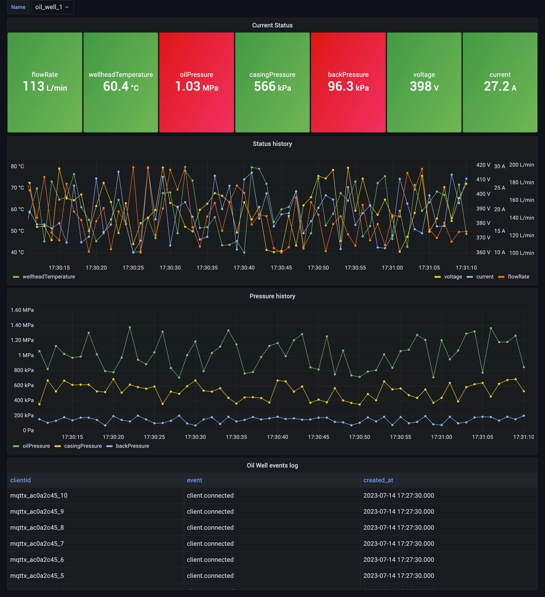
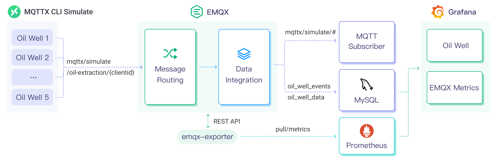

# mqtt-to-mysql

Ingesting IoT data into MySQL using MQTT and EMQX | MQTT MySQL Integration

## Introduction

This tutorial will show you how to use MQTT to ingest IoT data into MySQL. We will be using the [EMQX](https://www.emqx.io/) MQTT broker to publish and subscribe to messages. We will also be using the [MySQL](https://mysql.com/) database to store the data.

The scenario of this demo is based on oil extraction, enabling remote monitoring of real-time production data such as oil pressure, casing pressure, back pressure, wellhead temperature, and production rate. It utilizes Grafana to provide corresponding real-time status visualization and historical trend analysis charts. This enables real-time monitoring and management of devices in the process of oil extraction.



**Why MySQL?**

MySQL can be used to store and manage large volumes of data generated by Internet of Things (IoT) devices. It effectively handles and organizes sensor data, device status, log information, and more, providing reliable data storage and access.

MySQL can be used to store and manage device attributes, configuration information, and metadata. By utilizing MySQL's querying and updating capabilities, device registration, querying, configuration updates, and management can be achieved.

## Architecture



| Name      | Version | Description                                                                      |
| --------- | ------- | -------------------------------------------------------------------------------- |
| [EMQX Enterprise](https://www.emqx.com/en/products/emqx)      | 5.0.3+  | MQTT broker used for message exchange between MQTT clients and the MySQL. |
| [MQTTX CLI](https://mqttx.app/cli) | 1.9.3+  | Command-line tool used to generate simulated data for testing.        |
| [MySQL](https://mysql.com/)     | 8.0.0+  | Oil extraction IoT data storage and management, as well as providing time aggregation and analysis capabilities for Grafana.      |
| [EMQX Exporter](https://github.com/emqx/emqx-exporter)      | 0.1 | Prometheus exporter for EMQX |
| [Prometheus](https://prometheus.io/)   | v2.44.0  | Open-source systems monitoring and alerting toolkit.       |
| [Grafana](https://grafana.com/)   | 9.5.1+  | Visualization platform utilized to display and analyze the collected data.       |

## How to use

<!-- 1. Init the submodule to get the EMQX Exporter  (Optional):

  ```bash
  git submodule init
  git submodule update
  ``` -->

1. Please make sure you have installed the [docker](https://www.docker.com/), and then running the following commands to start the demo:

  ```bash
  docker-compose up -d
  ```

  > You can quickly init submodule and start the demo by using the `make` command as well.

2. Running the following commands to see the message from MQTTX:

  ```bash
  docker logs -f mqttx
  ```

3. If you want to view the oil extraction data and EMQX Metrics in Grafana dashboard, you can open <http://localhost:3000> in your browser, and login with `admin:public`.

## License

[Apache License 2.0](./LICENSE)
